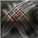
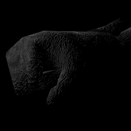
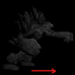

Hero Guides
============

## General information ##

### Spell set ###

While every hero is unique, their spell sets usually are divided in same way.

- **M1:** Main offensive spell. Extremely low cooldown. Bound to left mouse button by default
- **M2:** Typically ranged spell, even for melee heroes. Bound to right mouse button by default
- **Q:** Typically utility spell. Often used for *crowd control*. Bound to Q by default
- **E:** Usually hero's most powerful offensive spell. Bound to E by default
- **R:** Protective and buff spell. Bound to R by default
- **Space:** Movement spell. Bound to Space by default
- **Passive:** Each hero has passive "spell" that they can't activate anytime they want

Certain spells are divided into **primary** and **secondary spells**. Primary and secondary spells of same spell share same cooldown and are quite similar. Each hero has two secondary spells.

### Buffs and debuffs ###

**Note** that these aren't the only buffs and debuffs. There are also variations of each of these buffs and debuffs.

#### Positive buffs ####
- **Speed:** player gets higher movement speed
- **Armor:** player takes less damage from any attack. Deflected damage is removed from armor amount
- **Lifesteal:** whenever player does damage, they are healed for certain amount based on damage done
- **Damage boost:** Player's offensive spells do more damage
- **Heal over time:** Player's health is restored over time

#### Common crowd control debuffs ####

- **Stun:** player can't move or cast spells (there are currently no stuns in game)
- **Incapacitate:** like stun, but if player under incapacitate takes damage,  incapacitate is dispelled
- **Petrify:** like stun, but player takes heavily reduced damage. Has damage cap.
- **Fear:** player starts running away from source of fear. Player can't cast or control their movement during fear. Fear is dispelled on damage (there are exceptions)
-  **Blind:** Player under blind has very short sight range and thus can't see others unless they are very close
-  **Slow:** Player's movement is slower
- **Numb:** Player's cast speed is slower
- **Weaken:** Player's offensive spells do less damage

#### Other typical debuffs ####
- **Damage over time:** player takes damage over time

### Regeneration ###
If you stand still, don't use any of your abilities and don't take damage, you will start to regenerate after short period of time. Regeneration gets stronger and stronger as you stand still.

### Healing cap ###
To be implemented soon.

### General tips ###

- Be especially careful how you use your Space-spell. No other spell gives you as much survivability as Space.
  - With ranged heroes Space is often better used as escape mechanism.
  - Melee and tank heroes however often need Space to get close to their targets or to initiate.
- Though M1 is usually your weakest offensive skill, it also has lowest cooldown.
- Learn to predict your opponents' actions. Often failed prediction is better than not predicting at all.
- Try to choose battle where you have an advantage! Even battles lead to loss of large amounts of health and your enemy might escape just before killing blow. Someone will "steal your kill" and you are left weak. Even if you get the kill, you will be next one to die.
- Don't stand on fire!

## Ember Mage ##

**Lore**

The Ember Mage, Atriosis, has researched fire magic for hundreds of years
and even sacrificed his own soul to gain greater power. Now he’s but a husk
of his human self, driven only by his desire to create more powerful spells
of fire and destruction. He views his enemies as mere test subjects for
improving his magic. Anyone facing him should prepare themselves for a death
akin to torture.

**Description**

Ember Mage focuses on destructive long-range spells that cause his enemies to burn for damage over time.
Since he is weak in close range, it's better to keep a fair distance to other heroes.

### Skills ###

#### M1: Fireball ####
Shoots a medium-long-range projectile in the target direction. Short cooldown. Adds **Brimstone** stack on hit. Same character may have at most three Brimstone stacks.

####  M2: Magma Bash (primary) ####
Shoots a long-range projectile with a *incapacitate* effect in the target direction. Medium cooldown.

Length of incapacitate is higher if target has more **Brimstone** stacks. All Brimstone stacks are consumed on hit.

####  M2: Magma Release (secondary) ####
Like Magma Bash but instead of incapacitating, it does more damage.

The damage is higher if target has more **Brimstone** stacks. All Brimstone stacks are consumed on hit.

#### Q: Ember Circle ####
Creates a burning area in the target location. There is brief delay before burning activates. Once Ember circle is activated, it damages and *slows* enemies on target area. Medium cooldown.

#### E: Meteor ####
Drops a huge meteor in the target location. The closer the meteor hits the higher the damage and knockback effect. Long cooldown.

#### R: Purifying Flame (primary) ####
Creates a shield that deflects any projectile-based attacks and burns nearby enemies. Long cooldown.

#### R: Ethereal Flame (secondary) ####
Instead of deflecting projectiles, Ethereal Flame puts Ember Mage in **trance** state. If Ember Mage takes direct* attack during trance, it is completely deflected and Ember Mage teleports to the target location.

#### Space: Firewalk ####
Become invulnerable and unstoppable while quickly moving to the target location and burning enemies in your path. Long cooldown.

#### Passive: Ignite ####
Ignite is small **Damage over time** debuff that is applied through any of Ember Mage's spells except for Ethereal Flame. Ignite has short cooldown.

### Tips ###
- Ember Mage is fragile and has mediocre movement speed. Try to keep your distance.
- R-primary  is your best defense against ranged characters but less useful against melee heroes.
- When espacing from melee heroes and you have option to choose between R  and Space , you might want to consider using R-secondary first since Space is more flexible
- Try to land your M2  on enemy **after** you have hit them with couple *Fireballs first*. *Brimstone*-stacks amplify M2's effect.
- On the other hand, if melee hero reaches you before you've stacked Brimstone on them, don't waste time with Fireballs.
- If you hit enemy with *Magma Bash*, follow it up with perfect *Meteor* hit. If you really need to escape then don't, because Meteor will dispel *Incapacitate*.

## Venator ##

**Lore**

Little is known about the origins of this mysterious werebeast. Perhaps the
result of a magical curse or a forbidden experiment, it now roams the lands
to satisfy its endless thirst for blood. There are no reports of anyone
surviving after coming in close contact with the Venator, as it has
terrifying abilities to stop its prey from escaping.

**Description**

Venator focuses on getting close to its enemies and not letting them escape easily while it deals damage. Its abilities also steal life. While not completely helpless at long range with its dagger, Venator should aim to get in melee range.

### Skills ###

#### M1: Rend ####
Rapidly hits enemies at melee range in the target direction. Extremely short cooldown.

#### M2: Damaging Dagger (primary) ####
Shoots a projectile that applies **slow** on hit. Medium cooldown.

#### M2: Numbing Dagger (secondary) ####
Exactly like Damaging Dagger but instead of containing slow, it contains **numb** debuff.

#### Q: Feral Scream ####
Causes enemies in the target direction to uncontrollably run away in fear. Long cooldown.

#### E: Deep Wounds ####
Makes short charge in the target direction that does damage and inflicts enemy hit with a bleed effect that drains life whenever they move. Long cooldown.

#### R: Survival Instinct (primary) ####
Venator's survival instinct gives it what it needs to survive. The more health Venator has, the more it does damage. The weaker the Venator is, the faster Venator moves. Long cooldown.

#### R: Blood Frenzy (secondary) ####
Venator's lust for blood gives Venator extremely strong **lifesteal** buff but Venator's spells lose some accuracy, causing them to do less damage.

#### Space: Leap ####
Leap into the target location and **incapaciates** enemies in the landing area. Long cooldown.

#### Passive: Blood drinker ####
Venator has base lifesteal that cannot be dispelled

### Tips ###
- If you are low on health, you can try following hit-and-run combo against single targets:
  - Steps:
     1. (Optional) Use either of your R spells  to boost your combo.
     2. Use *Leap*  to get close to your enemy and *incapacitate* them
     3. Use *Deep Wounds*  to apply *Bleed* debuff on them.
     4. Use *Feral Scream*  to *Fear* your enemy. Bleed DOES NOT interrupt Fear.
     5. Just before Fear ends, throw *Damaging Dagger*  on your target.
  - If executed succesfully, combo does lot of damage and because of your *lifesteal*, you end up healthier.

- Variation of previous combo is to start melee attacking (M1) your target after *Deep Wounds* . Save *Feral Scream*  for later. This combo might be more effective if you are healthy.

- If you are low on health and need to escape *Survival Instinct (R primary)*  is very useful. It gives you lot of movement speed if you have low health.

## Rock Golem ##

**Lore**

The Rock Golem is an ancient construct built for protecting sacred places
from the forces of evil. After the destruction of its temple, this Rock Golem
has gone on a journey to vanquish evil and to find a new place to
protect. Perhaps, after journeying for enough time, it might once again be
able to fulfill its original purpose by finding something uncorrupted and
worth protecting

**Description**

Rock Golem is melee hero that focuses on getting close enough to its enemies that it can chain several abilities together for a devastating effect. Rock Golem is capable of taking lots of damage with its high health and protective spells.

### Skills ###

#### M1: Stone Fist ####
Hits enemies at melee range in the target direction. Short cooldown.

#### M2: Sealing Boulder ####
Shoots a projectile with *petrify* debuff in the target direction. Medium cooldown.

#### Q: Spirit Stone (primary) ####
Creates a stone at the target location that can be either punced (M1) or tossed (E) in the target direction/location. It also blocks any attacks and gives small boost to movement speed to friendly
players in certain range. Long cooldown.

#### Q: Angry Spirit Stone (secondary) ####
Exactly like Spirit Stone but shorter duration, shorter range of influence but has slow more powerful than Spirit Stone's speed boost.

#### E: Toss ####
If an player or a Spirit Stone is in (approximately) melee range, tosses it into the target location. Both the tossed enemy and any nearby enemies take damage upon landing. Long cooldown.

#### R: Mineral Armor (primary) ####
Gives the Rock Golem *armor* and *heal over time* buffs for a short period. The power of heal is dependent on how much armor there's left. Long cooldown.

#### R: Bedrock (secondary) ####
Instead of gaining *heal over time*, Rock Golem gains high amount of *armor* that absorbs most the damage received. Also reduces Rock Golem's movement speed considerably for a short period.

#### Space: Earthquake ####
Charges rapidly towards the target direction until hitting an enemy or object (or after charging maximum range). Incapacitates and damages enemies in the collision area. Long cooldown.

#### Passive ####
Rock Golem doesn't have passive at the moment.

### Tips ###
- Hitting enemy with *Sealing Boulder* gives you best possible opportunity to punch *Spirit Stone* on them. For example, one of the deadliest single target combos of *Rock Golem* is following:
  1. Use *Earthquake*  to get close to your enemy and for initial damage.
  2. Quickly throw *Sealing Boulder*  to *Petrify* (and it does some damage too).
  3. Put *Spirit Stone*  between you and your enemy
  4. Wait just a little bit and then punch  the stone so that it hits enemy right after Petrify ends.
  5. Usually enemy escapes at this point but with some luck you might be able to toss   something on them or toss enemy somewhere for extra damage.

- If fighting against ranged hero that you can't reach conveniently, use either of your R-spells and toss the resulting stone to enemy.

- When escaping, you can often *Toss* enemy behind wall.

- It's often futile to try to run away from Venator that has reached melee range since you are so slow. Venator will do free damage to you and heal itself with *lifesteal*. If you can't use any other spells, put up good fight and use *Stone Fist* ! After your cooldowns are over, you may either escape or try to kill Venator with one of your deadly combos.

## Elite Soldier ##

**Lore**

With his cunning, extreme speed and arsenal of weapons, Grok the Elite
Soldier has single-handedly thwarted multiple invasions of aliens and demons
alike. Using dimensional a doorway, he has come to stop chaos and evil once
again and ultimately, to prove his superior elite skills

**Description**

Elite Soldier is a versatile hero that can pursue various strategies
depending on the situation. He can pursue his enemies in medium range
with his Shotgun, Rocket Launcher and Plasmagun or keep his distance
and snipe enemies with his Railgun and Plasma Grenades.

Unique aspect of Elite Soldier is that he has two different cooldown systems. Most of Elite Soldier's offensive spells have
short cooldown, but they also consume ammunition. Because of this, Elite Soldier can do high damage by repeatedly casting
his more powerful spells.

### Skills ###

#### M1: Shotgun ####
Shoots a large amount of projectiles in the target direction at medium range. Short cooldown with limited. Consumes *Pellets*.

#### M2: Railgun (primary) ####
Shoots a very damaging and long-range laser beam in the target direction. Long cooldown.

**Important note** Though railgun shot's properties resemble those of projectile's, it isn't actually projectile. It can go through multiple enemies and it is not absorbed by Ember Mage's shield.

#### M2: Blinding Ray (secondary) ####
Instead of dealing high damage, blinds the enemy (making him unable to see far) for a short period.

#### Q: Plasmagun (primary) ####
Shoots three plasma balls with a slowing effect in the target direction at medium range. Short cooldown. Consumes three *Plasma* units.

#### Q: Plasma grenades (secondary) ####
Instead of shooting plasma balls in a straight line, shoot three plasma grenades in an arc over the air. Consumes three *Plasma* units.

#### E: Rocket Launcher ####
Shoots projectile that does medium damage and has powerful knockback in the target direction at medium range. Short cooldown. Consumes one *Rocket*.

#### R: Like a Pro ####
Gives the Elite Soldier the ability to cast his spells while moving, *Speed* buff, *Armor* buff and immediately gives some ammunition to all weapons. Long cooldown.

#### Space: Rocket Jump ####
Jump into the target location and deal damage to nearby enemies upon jumping. Long cooldown. Consumes one *Rocket*.

#### Passive: Collect ammunition ####
Elite soldier collects ammunition over time.

- **Pellets:** Required by *Shotgun*. Short reloading time.
- **Plasma:** Required by *Plasmagun* and *Plasma grenades*. Medium reloading time.
- **Rockets:** Required by *Rocket Launcher* and *Rocket Jump*. Long reloading time.

### Tips ###
- Try to use *Like a Pro*  whenever you fight. Ability to cast while moving allows you to dodge spells while staying offensive yourself. *Armor* greatly reduces damage whenever you are hit.
- Rocket Launcher serves multiple purposes. Its *knockback* helps you keep distance to enemy and disrupts them. It has medium damage but also low cooldown.
- Try to reserve at least one *Rocket* for *Rocket Jump*  whenever you use *Rocket Launcher* .
- When you *Rocket Jump*, you can start casting spells even in mid-air. One useful offensive combo is to *Rocket Jump*  next to enemy and start casting *Rocket Launcher* before landing. If isn't prepared, you can often avoid taking damage yourself because of Rocket's *knockback*
- When dealing with Ember Mage, save M2 for countering *Purifying Flame* . M2 is your only attack that isn't absorbed by Purifying Flame's shield.
- *Blinding Ray's (M2 secondary)* has shorter casting time than *Railgun*  and blinds enemies hit. If under pressure, prefer Blinding Ray.
